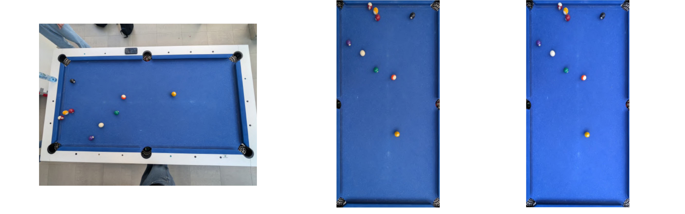
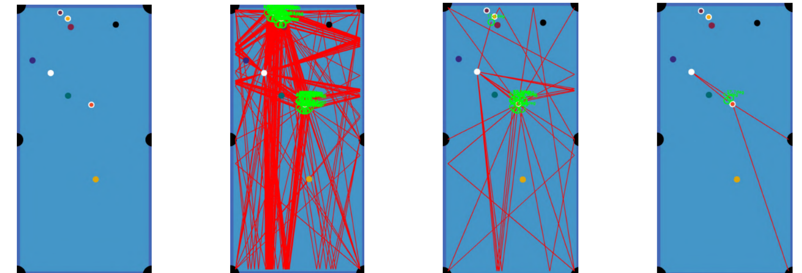

# Poolgame analysis and prediction system

An AI-powered system that analyzes pool (billiards) table images. It combines computer vision for ball and table recognition with mathematic formulas to suggest the best move possible.

<hr>


## Table of Contents

- [Overview](#overview)
- [Key Features](#key-features)
- [Math-backed Code](#Math-backed-code)
- [Methodology & Code Deep Dive](#methodology--code-deep-dive)

## Overview

This project aims to assist billiard players of all skill levels by providing AI-driven shot recommendations. By simply uploading a picture of the pool table, the system:

1. Corrects perspective of the photo
  
2. Normalises colors for consistent analysis
  
3. Detects and classifies balls
  
4. Generates hundreds of possible shots
  
5. Validates the shots
  
6. Recommends the best shots for the player and displays them
  

(obraz)


**&emsp;&emsp;&emsp;&emsp;&emsp;&emsp;1. Input photo &emsp;&emsp;&emsp;&emsp;&emsp;&emsp;&emsp;&emsp;2. Transformation &emsp;&emsp;&emsp;&emsp;&emsp;&emsp;3. Color**
**&emsp;&emsp;&emsp;&emsp;&emsp;&emsp;&emsp;&emsp;&emsp;&emsp;&emsp;&emsp;&emsp;&emsp;&emsp;&emsp;&emsp;&emsp;&emsp;&emsp;&emsp;&emsp;&emsp;&emsp;&emsp;&emsp;&emsp;&emsp;&emsp;&emsp;&emsp;&emsp;&emsp;&emsp;&emsp;normalisation**


**&emsp;&emsp;4. Balls &emsp;&emsp;&emsp;&emsp;&emsp;&emsp;&emsp;&emsp; 5. Shots &emsp;&emsp;&emsp;&emsp;&emsp;&emsp;&emsp;&emsp; 6. Shots &emsp;&emsp;&emsp;&emsp;&emsp;&emsp; &emsp;&emsp;7. Final**
**&emsp;&emsp; &emsp;&emsp;detection &emsp;&emsp;&emsp;&emsp;&emsp;&emsp;&emsp;calculation &emsp;&emsp;&emsp;&emsp; &emsp;&emsp;&emsp;validation &emsp;&emsp;&emsp;&emsp;&emsp;&emsp; suggestion**


## Key Features

|     | Feature | Description |
| --- | --- | --- |
| ✅   | **Smart Image Preprocessing** | Automatically corrects perspective and normalises colors for consistent analysis under any lighting conditions |
| ✅   | **AI Ball Detection** | Our YOLOv5 model detects and classifies all balls with over 92% accuracy, handling overlaps and difficult lighting |
| ✅   | **Shot Recommendation** | Generates and ranks hundreds of possible shots based on angle, distance, and complexity to suggest the 3 best options. |
| ✅   | **Physics-Based Simulation** | Implements a simplified physical model for cue ball trajectory prediction after collision, accounting for friction |

## Math-backed code

matematyka

## Methodology & Code Deep Dive

1. **Perspective Correction & Color Normalization** 
  Before analysis, the image is standardized. We detect the table's corner pockets using Hough Circle Transform and warp the perspective to a consistent top-down view. Colors are then normalized based on the white ball to counteract different lighting conditions.
  
  ```python
  # Snippet: Color Normalization using the white ball
  from PIL import Image, ImageStat
  import numpy as np
  
  def normalize_colors(img, white_ball_center, white_ball_radius):
      """ Normalizes image colors using the white ball as a reference. """
      # Extract region of interest (ROI) around the white ball
      x, y = white_ball_center
      r = white_ball_radius
      roi = img.crop((x-r, y-r, x+r, y+r))
  
      # Convert ROI to numpy array and create a circular mask
      roi_np = np.array(roi)
      h, w = roi_np.shape[:2]
      Y, X = np.ogrid[:h, :w]
      dist_from_center = np.sqrt((X - w/2)**2 + (Y - h/2)**2)
      mask = dist_from_center <= r
  
      # Get pixels within the white ball using the mask
      pixels = roi_np[mask]
  
      # Use a high percentile to avoid shadows and get the "true" white
      ref_color = np.percentile(pixels, 95, axis=0)
  
      # Calculate scaling factors for each RGB channel
      scale_factors = 255.0 / ref_color
  
      # Apply scaling to the entire image
      img_normalized = (img * scale_factors).clip(0, 255).astype(np.uint8)
      return img_normalized
  ```
  

       2. **Ball Detection & Classification with YOLO**